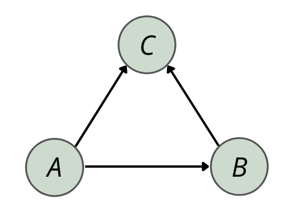

```{r setup, include = FALSE}
library("papaja")
r_refs("r-references.bib")
knitr::opts_chunk$set(fig.pos = "H", out.extra = "")

setwd("../data_preparation/prepared_data")
graph <- igraph::read_graph(
  file = "network.graphml",
  format = "graphml"
)

# Loading environments
load("/Users/huubvandevoort/Downloads/hierstaatveelkakin.RData")
load("/Users/huubvandevoort/Downloads/voorHubie.RData")
```

```{r analysis-preferences, include = FALSE}
# Seed for random number generation
set.seed(42)
knitr::opts_chunk$set(cache.extra = knitr::rand_seed)
```
<!---
# Citations in papaja, detele appropriately later {-}

Add the bibtex entry in the .bib file. You can find the entries in Google scholar, but double check since it is not always correct.

Call the citations in the text:

Citation within parentheses [@cinelli2021echo]

Multiple citations [@R-papaja; @R-base]

In-text citations @R-papaja

Year only [-@R-base]

Only if your citation appears in the text it will also show up in the Reference list. Don't manually modify the Reference list.
-->

# Executive Summary {-}

(150 words) -- 0.3 POINTS Summarize the report. Write this as the very last thing.

- What is the main topic you are addressing?
- What are your research questions and hypotheses?
- What are your results and the main conclusion?

# Introduction
<!-- Dit heb ik gekopieerd omdat ik references wilde testen -->
Research on social media platforms, such as Twitter and Facebook, extensively explores echo chambers - environments where individuals connect with like-minded peers, reinforcing selective exposure to information aligning with their beliefs [@cinelli2021echo]. These principles, observed on social media platforms marked by informational homogeneity, apply to broader political discourse and policy debates [@jasny2015empirical]. This suggests that the mechanisms of selective exposure observed in social media echo chambers may extend to diverse communication networks [@colleoni2014echo]. In the political domain, these tendencies contribute to polarization and extreme political positions [@colleoni2014echo]. This harms social cohesion and trust, challenging finding common ground between political parties [@mccoy2019toward] and shaping public discourse across diverse communication networks [@levy2019echo]. Despite extensive research on platforms such as Twitter, the impact of echo chambers on YouTube, the second-largest social platform, remains understudied. YouTube's unique structure and user interaction patterns, distinct from platforms like Twitter, may pose challenges in recognizing and understanding echo chambers on this platform.

# Methodology

## Dataset
<!-- Network plot -->
(ref:main-network) The plot of the network used for analysis. It shows the majority of the nodes labelled negative.
```{r main-network-plot, echo = FALSE, include = TRUE, fig.align='center', fig.cap = "(ref:main-network)", fig.dim=c(8,8)}
# Code for plotting the network
igraph::V(graph)$color <- "black"
igraph::V(graph) [ sentiment == 'negative' ]$color <- "#F25F5C"
igraph::V(graph) [ sentiment == 'positive' ]$color <- "#9DBF9E"
igraph::V(graph) [ sentiment == 'neutral' ]$color <- "#FFE066"

plot(
  graph,
  vertex.label = NA,
  edge.arrow.size = .35,
  vertex.size = 3,
  vertex.color = igraph::V(graph)$color
)

colrs <- c("#F25F5C","#9DBF9E","#FFE066")
graphics::legend(x = 0.75, y = -.85, c("Negative","Positive","Neutral"), 
                 pch = 21, col = "#777777", pt.bg = colrs, pt.cex = 1.5, 
                 cex = .8, bty = "o", ncol = 1)

```

<!-- Indegree distribution -->
(ref:degree-in) The plot above shows the indegree distribution for the actors in the network. 
```{r degree-in, echo = FALSE, include = TRUE, fig.align='center', fig.cap = "(ref:degree-in)", fig.dim=c(4,4)}
# Code for plotting the indegree distribution
degree_distribution_in <- snafun::g_degree_distribution(graph, 
                                                        mode = "in", 
                                                        type = "count"
                                                        )
# Create a frequency plot with lines
plot(1:length(degree_distribution_in), degree_distribution_in, type = "h", 
     lwd = 2, main = "Indegree Distribution",
     xlab = "Indegree", ylab = "Frequency")
```

<!-- Outdegree distribution -->
(ref:degree-out) The plot above shows the outdegree distribution for the actors in our network.
```{r degree-out, include = TRUE, echo = FALSE, results = "hide", fig.align='center', fig.cap = "(ref:degree-out)", fig.dim=c(4,4)}
# Code for plotting the outdegree distribution
degree_distribution_out <- snafun::g_degree_distribution(graph, 
                                                         mode = "out", 
                                                         type = "count"
                                                         )

# Create a frequency plot with lines
plot(1:length(degree_distribution_out), degree_distribution_out, type = "h", 
     lwd = 2, main = "Outdegree Distribution", 
     xlab = "Outdegree", ylab = "Frequency")
```

<!-- Table for reciprocal dyads -->
(ref:dyad-count-table) An overview of the reciprocal dyads. 
```{r dyad-count-table, echo = FALSE, include = TRUE, fig.align='center', fig.pos='H'}
dyad_count <- snafun::count_dyads(graph, echo = FALSE)
# knitr::kable(dyad_count, caption = "(ref:dyad-count-table)")
apa_table(dyad_count,
          placement = "h",
          caption = "(ref:dyad-count-table)")
```

### Potential Bias

## Research Rationale

<!-- Figure for displaying structrue of 030T -->
(ref:echo-chamber-structure) An echo chamber representation within the structural network configuration, also known as a transitive triad.
```{r echo-chamber-structure, fig.align='center', fig.cap = "(ref:echo-chamber-structure)", echo = FALSE}
# Reading file from figures directory

```

<!-- CUG results -->
(ref:cug-results) The results of the CUG test. 
```{r cug-results, echo = FALSE, include = TRUE, fig.align='center', fig.cap = "(ref:cug-results)", fig.dim=c(4,4)}

```

Table: Results of CUG tests.

|                           | Empirical Value | Probability versus simulations $Pr(X>=Obs)$ |
| ------------------------- | --------------- | ------------------------------------------ |
| **Eigenvector Centrality** | 0.92            | 0.466                                      |
| **Degree Centrality**      | 0.12            | 0                                          |
| **Betweenness Centrality** | 0.13            | 0.451                                      |


# Results

## Study 1: {-}

## Study 2: {-}

# Discussion and Conclusion

\newpage

# References {-}

```{=tex}
\begingroup
\setlength{\parindent}{-0.5in}
\setlength{\leftskip}{0.5in}
```
::: {#refs custom-style="Bibliography"}
:::

```{=tex}
\endgroup
```

\newpage

# Appendix A {-}

```{r child = "SNA4DS_Report_files/appendix/appendix_a.Rmd"}
```

# Appendix B {-}

```{r child = "SNA4DS_Report_files/appendix/appendix_b.Rmd"}
```

